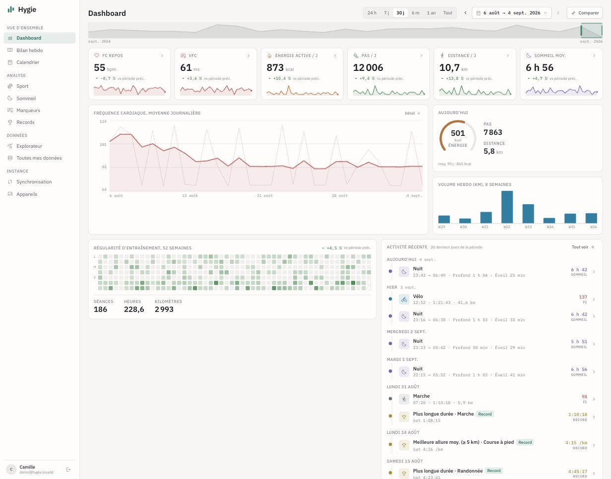
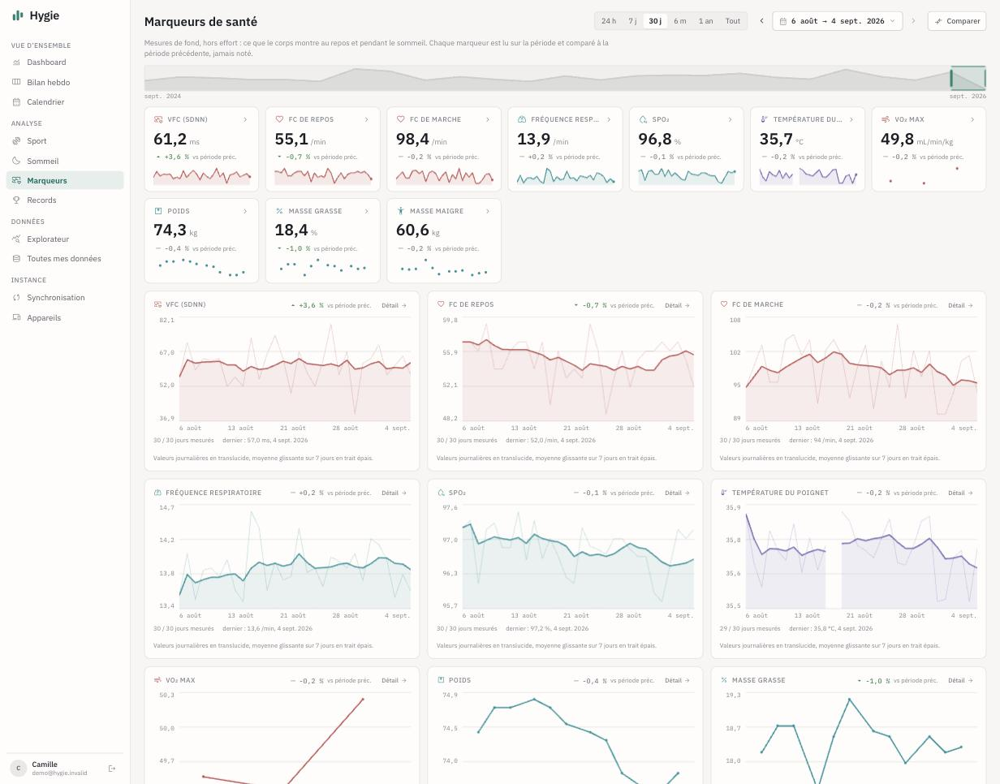
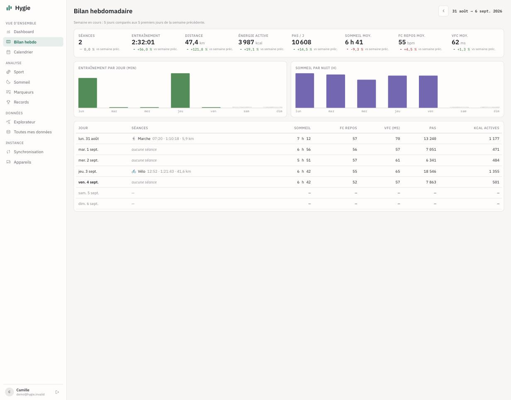
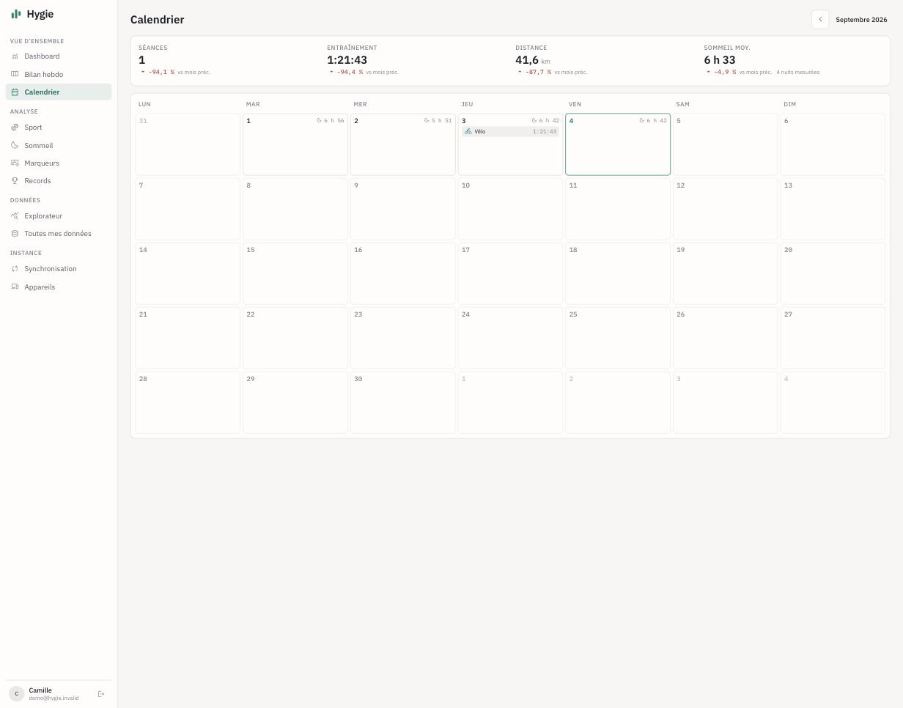
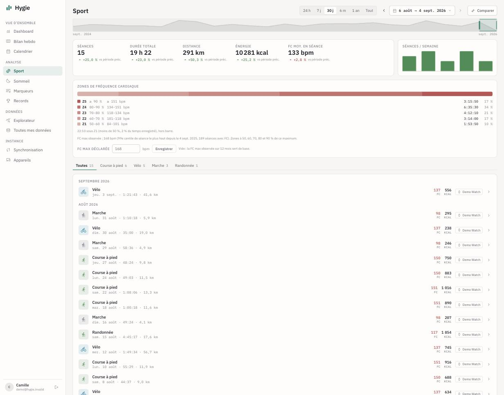
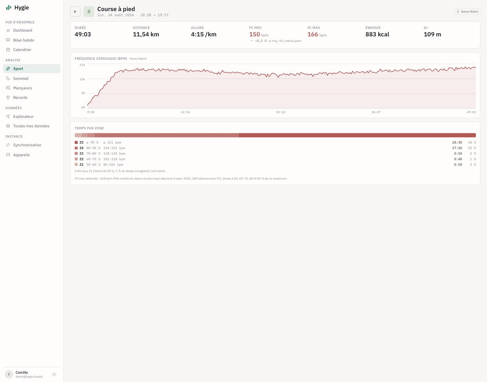
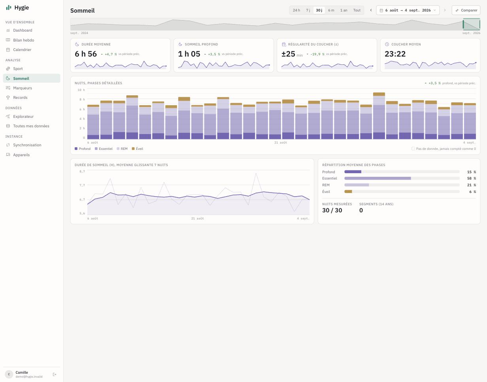
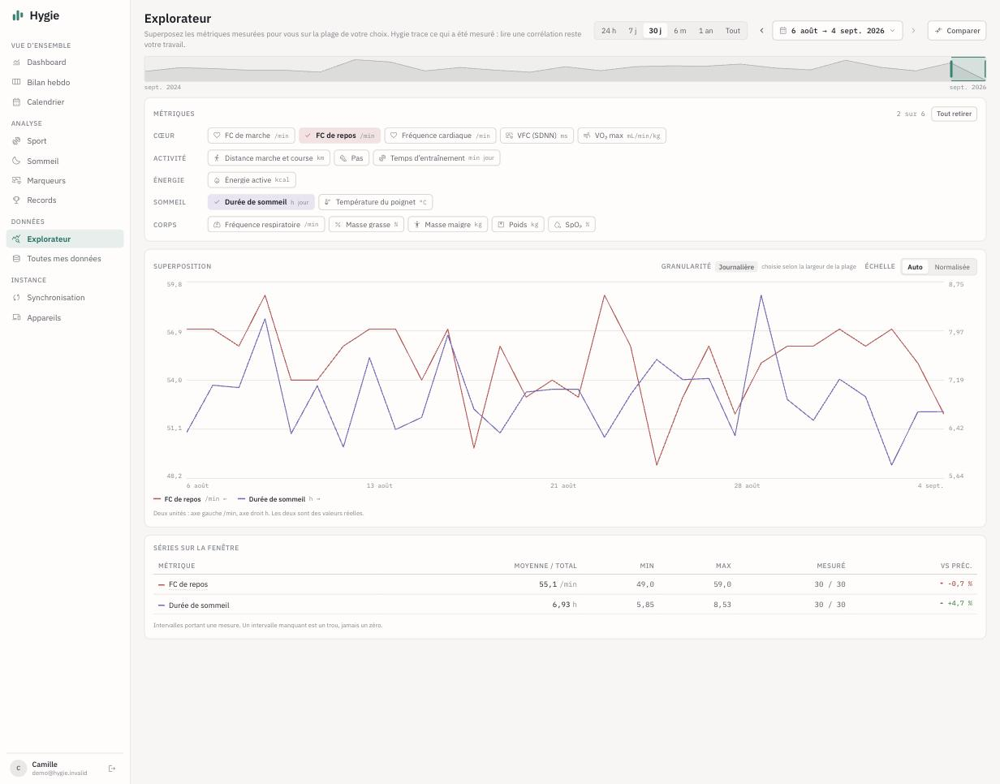
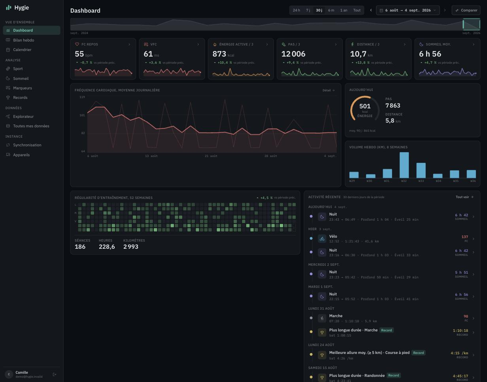

# Hygie

Self-hosted web dashboard for Apple Health data: workouts, sleep, health markers, records,
trends and every HealthKit metric, on a real screen instead of a phone.

**Status: in production for its author** (7M+ measurements, 14 years of history, 96 metric
types), pre-1.0 for everyone else: it works, but the self-hosting guide is still being
written. Open source under AGPL-3.0; a paid iOS companion app (Hygie Sync) will fund the
project once it reaches the App Store. Presentation site: [hygie.letmiko.com](https://hygie.letmiko.com).

## What it does

- **Fully flexible time navigation**: any window from 24 hours to all-time, period-over-period
  comparison, minute/hour/day granularity picked from the window width. All state in the URL.
- **Dashboard, weekly review, calendar**: the whole picture, one week against the previous one
  (pro rata while the week is in progress), one month of sessions and nights.
- **Sport**: sessions by sport, weekly volume, heart rate zones over any window up to a quarter
  and for each session, cut from an observed maximum (highest per-session 99th percentile over
  a year) or from a maximum you declare.
- **Sleep**: nights with their stages, hourly grid, bedtime regularity, rolling trend.
- **Health markers**: HRV, resting and walking heart rate, respiratory rate, SpO₂, wrist
  temperature, breathing disturbances, VO₂ max, weight and body composition, each read over the
  window and against the previous one. No composite score: the numbers, their trend, their curve.
- **Records replayed against the full history**: a displayed record is a proven one, with the
  mark it replaced.
- **Explorer and full metrics catalog**: up to six metrics on one chart; every metric type present
  in the database gets a reference page (statistics true to its aggregation semantics, raw
  measurements included).
- **Two ingestion channels, deduplicated**: streaming XML import of the native Apple Health
  `export.zip` for the past (runs locally, never through HTTP), continuous push from the
  iPhone for what comes next, through [Health Auto Export](https://www.healthyapps.dev/) or
  the first-party Hygie Sync app (HealthKit at the source, background delivery).
- **Hourly rollups** for deep history, raw data for the present; both read paths proven equal
  point by point across time zones. p95 budget of 500 ms, held on 7M rows.
- **Multi-account by design, never open signup**: a household where each member sees only
  their own data and the admin sees none of it. Magic-link auth, per-device API keys.
- **Encrypted off-platform backups**: `pg_dump` streamed into [age](https://age-encryption.org/)
  toward a public key; the private key never exists on the server. Restore rehearsed for real.

## Screenshots

Every screenshot below comes from the synthetic dataset (`npm run synthetic`, see
below): one invented person, two years of plausible measures. No real health data anywhere in
this repository.

| | |
|---|---|
|  Health markers |  Weekly review |
|  Calendar |  Sport, heart rate zones |
|  Session detail |  Sleep |
|  Explorer |  Dashboard, dark theme |

## Design principles

- **No health data in this repo, ever.** No fixtures from real exports, no screenshots with
  real values, no sample dumps. Synthetic data only.
- **No secrets in code or history.** All configuration through environment variables. `.env*`
  is git-ignored; `.env.example` documents the contract.
- **No data ≠ zero**, everywhere: a day without measurements is shown as such, never as an
  invented zero.
- **Trends are first-class** and color encodes the quality of a trend, not its direction:
  a falling resting heart rate is good news, a moving magnesium intake is not an opinion.
- **An instrument, not a coach.** No readiness score, no strain index, no advice: what the body
  shows, with its context.
- **The database is reconstructible.** Raw detail is kept, rollups are derived and rebuildable.

## Stack

Next.js (App Router, standalone output) + PostgreSQL, one Dockerfile for the reference
deployment (Railway) and self-hosters alike. Forward-only SQL migrations (`npm run migrate`),
never run automatically at boot. Read `docs/architecture.md` first: it is the contract.

## Self-hosting

The short version, until the guide exists: PostgreSQL 16+, `cp .env.example .env` and fill it,
`npm run migrate && npm run seed`, build and run the Dockerfile (or `npm run build && npm start`).
Backfill your history with `npm run backfill -- export.zip --subject <uuid>`, then
`npm run rollups -- --subject <uuid>`. When you replace the phone that feeds Hygie, run
`npm run cutover -- --device <new device name>` so the new device becomes the authority for
the minute channel (otherwise its data is logged as conflicts and never written). Open an
issue if you get stuck: real-world reports are exactly what pre-1.0 needs.

### Try it with synthetic data

`npm run synthetic -- --email you@example.com --yes` creates a demo subject with 400 days of
invented measures, sessions and nights (deterministic seed), then prints the `npm run rollups`
command to run next. Request a magic link for that email and you are in. For development,
set `HYGIE_MAIL_CAPTURE_DIR` and the magic-link email lands in that directory as JSON instead
of being sent. Never run it against a production database.

## License

[AGPL-3.0](./LICENSE). Self-host it, modify it, share it; if you serve a modified version to
others, publish your changes.
